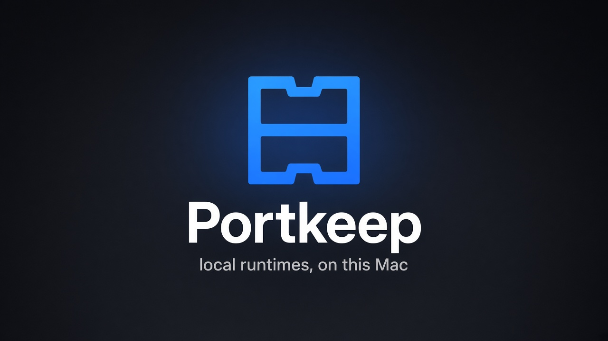
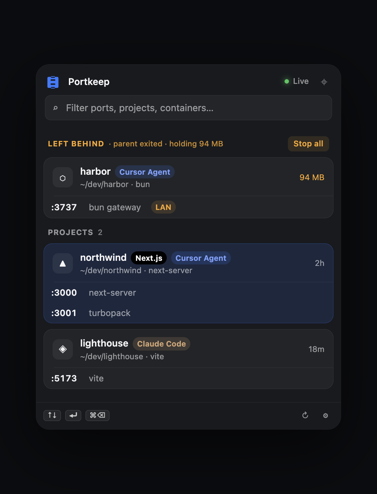
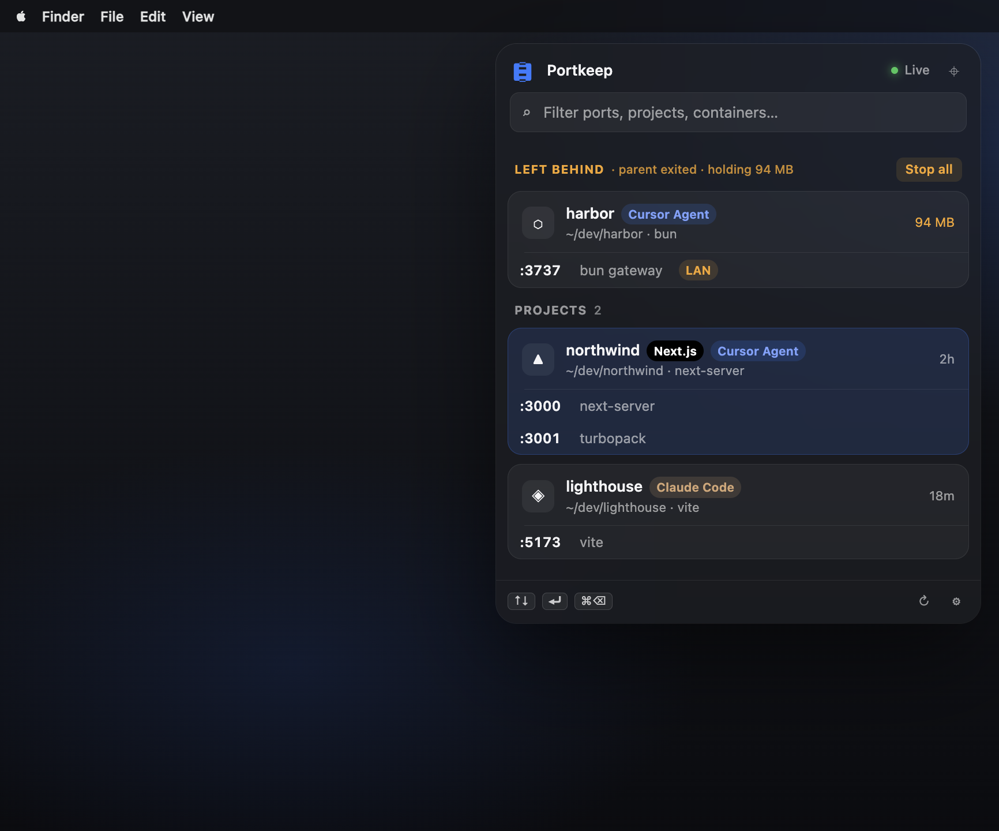
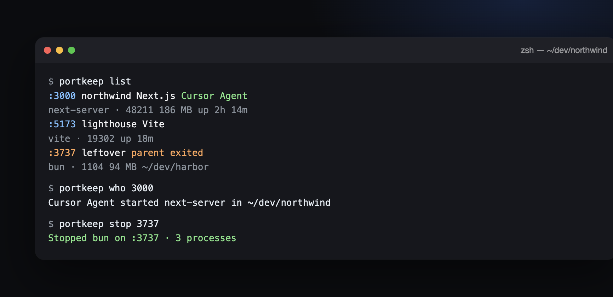

<p align="center">
  
</p>

<h1 align="center">Portkeep</h1>

<p align="center">
  Local runtimes, on this Mac.<br>
  See who owns <code>:3000</code>. Stop the leftover tree.
</p>

<p align="center">
  <a href="LICENSE"></a>
  <a href="https://github.com/Slowper/Portkeep"></a>
  <a href="https://github.com/Slowper/Portkeep"></a>
  
</p>

<p align="center">
  
</p>

Portkeep is a macOS menu bar app for leftover localhost ports. It shows what is listening, which project it belongs to, and whether a human, Cursor, or Claude Code started it. Stop the whole process tree. Reserve a stable port per worktree. Give agents a CLI and MCP.

**Yours, with no catch.** Ports, PIDs, command lines, and folders stay on this Mac. There is no account, no analytics, and no paid tier. The only optional network call is a Sparkle version check you can turn off.

<p align="center">
  
</p>

## What it looks like

<p align="center">
  
</p>

<table>
  <tr>
    <td width="50%">
      
      <p align="center"><sub>The panel. Leftovers first. Then your projects.</sub></p>
    </td>
    <td width="50%">
      
      <p align="center"><sub>Same picture from the terminal.</sub></p>
    </td>
  </tr>
</table>

- **Who started this** — Cursor Agent, Claude Code, your terminal, or an orphan reparented to launchd.
- **Stop the tree** — not just the pid on the port. The wrapper, the children, then SIGKILL if it hangs.
- **Stable ports** — `portkeep alloc web` gives the same port back in this worktree.
- **Policy** — postgres, redis, ollama, and other known services stay locked. `--force` is SIGKILL only; it does not bypass policy.

## Install

Menu bar extra — no Dock icon. Hotkey: Control-Option-P.

```sh
git clone https://github.com/Slowper/Portkeep.git
cd Portkeep
xcodegen generate
xcodebuild -project Portkeep.xcodeproj -scheme Portkeep -configuration Debug \
  -derivedDataPath /tmp/portkeep-dd build
open /tmp/portkeep-dd/Build/Products/Debug/Portkeep.app
```

Needs macOS 14+, Xcode 16+, and [XcodeGen](https://github.com/yonaskolb/XcodeGen). Open Settings from the panel, or run `portkeep settings`.

A signed, notarized disk image is not in this repo. Build one with `./scripts/release.sh` if you have a Developer ID.

## CLI

After Settings → Agents → Install, or from `Portkeep.app/Contents/Helpers/portkeep`:

```
portkeep list                 what's listening
portkeep who 3000             who owns a port
portkeep alloc web            same port next time, in this worktree
portkeep stop 3000            stop the process tree
portkeep install --mcp        CLI + Cursor / Claude Code MCP
portkeep snippet --write      AGENTS.md block for this folder
```

<p align="center">
  
</p>

## Privacy

Nothing leaves this Mac except an optional Sparkle version check. See [website/privacy.html](website/privacy.html).

## MDM

`mdm/` has a sample profile. `scripts/pkg.sh` builds an installer pkg. Preference domain: `com.sajidpalagiri.portkeep`. See `mdm/IT.txt`.

## License

[MIT](LICENSE). Issues and pull requests are welcome. Keep stops policy-safe. Do not commit signing keys, notarized disk images, or `~/.portkeep` data.
